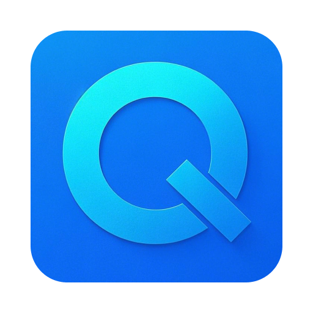
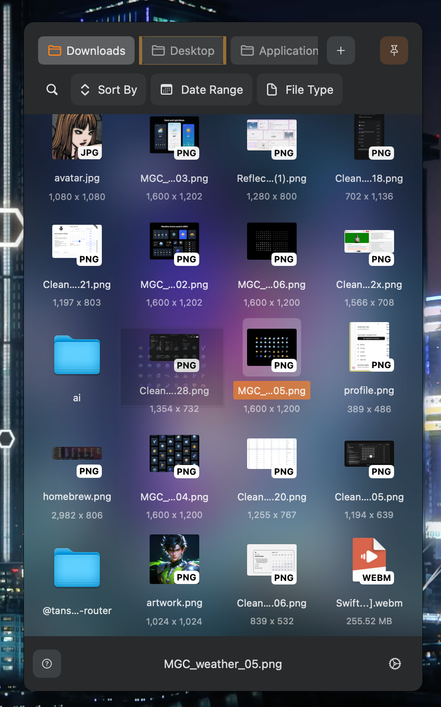
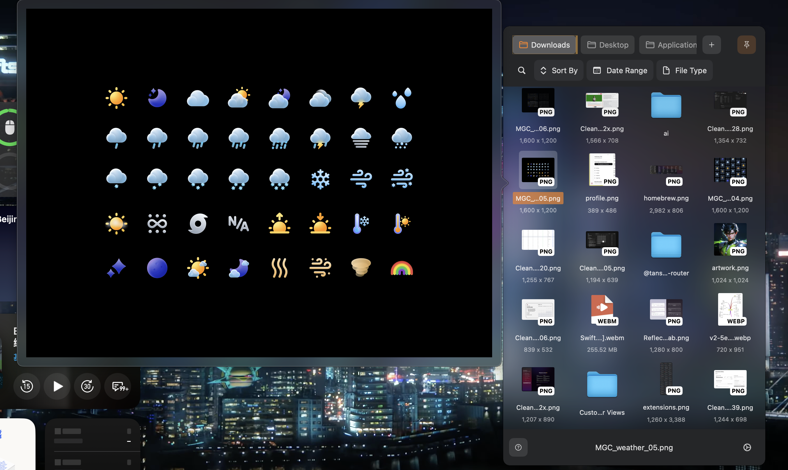

  <h3 align="center">Quick-Finder</h3>
  

    
  

  

   Easy way to operate MacOS Folder
     
    ·
    <a href="https://github.com/GaoZimeng0425/Quick-Folder-App/issues">Report Bug</a>
    ·
  

<h3 align="center">APP screenshot</h3>

  

<h3 align="center">image preview</h3>

  

## Highlights

- Quick access
- Picture Preview
- File sorting, type filtering

## OS Requirement

macOS 14 minimum for SwiftUI support

## Statement

developed by interest
